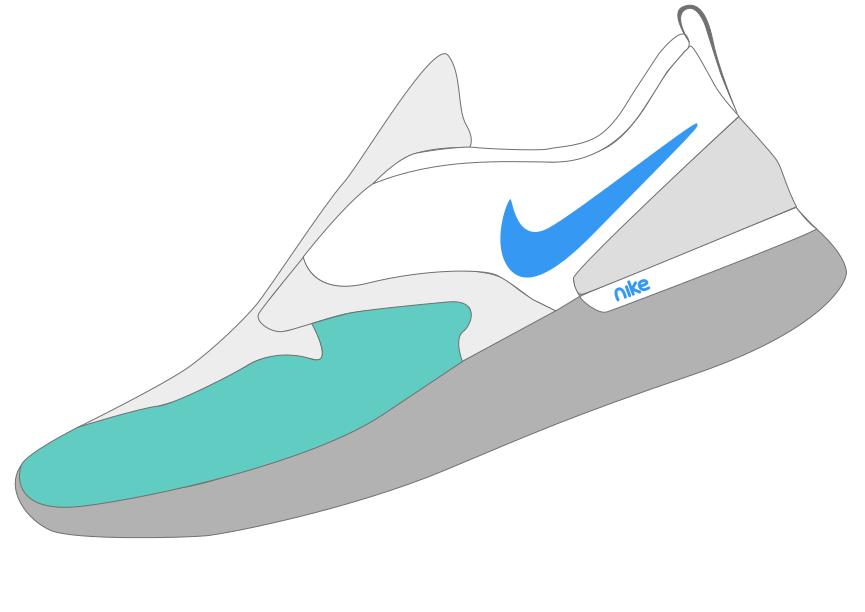

    

# Nike website concept

Nike website concept developed for school project.  
This project was prototyped with [Adobe XD](https://www.adobe.com/si/products/xd.html) and build with [React.js](https://reactjs.org/). 
You can find UI design prototype file at: `src/assets/Landing.svg`.

## Available Scripts

In the project directory, you can run:

#### `npm start`

Runs the app in the development mode. 
Open [http://localhost:3000](http://localhost:3000) to view it in the browser.

#### `npm test`

Launches the test runner in the interactive watch mode. 

#### `npm run build`

Builds the app for production to the `build` folder. 